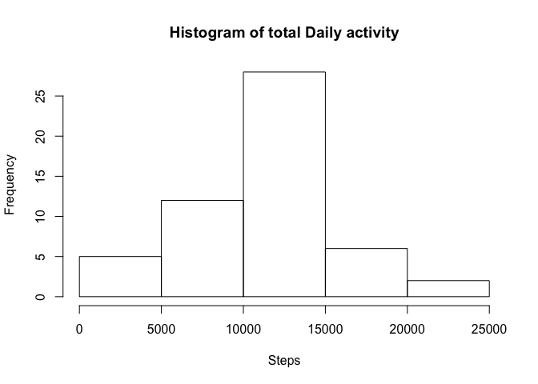
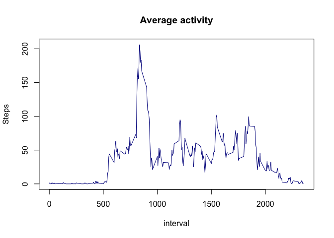
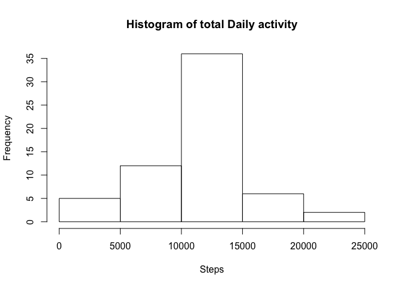
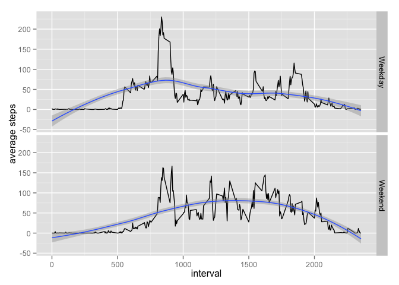

# Reproducible Research: Peer Assessment 1

It is now possible to collect a large amount of data about personal movement using activity monitoring devices such as a Fitbit, Nike Fuelband, or Jawbone Up. These type of devices are part of the “quantified self” movement – a group of enthusiasts who take measurements about themselves regularly to improve their health, to find patterns in their behavior, or because they are tech geeks. But these data remain under-utilized both because the raw data are hard to obtain and there is a lack of statistical methods and software for processing and interpreting the data.

This analysis makes use of data from a personal activity monitoring device. This device collects data at 5 minute intervals through out the day. The data consists of two months of data from an anonymous individual collected during the months of October and November, 2012 and include the number of steps taken in 5 minute intervals each day.

## Loading and preprocessing the data

```r
unzip("activity.zip")
activity <- read.csv("activity.csv",na.strings = "NA")
clean_activity <- activity[complete.cases(activity),]
```


## What is mean total number of steps taken per day?

Calculate the total number of steps taken per day

```r
# sum data by date 
total_steps_by_date <-aggregate(clean_activity$steps, list(clean_activity$date), FUN = sum)
# add column names
colnames(total_steps_by_date) <- c("date", "total_steps")
```

Make a histogram of the total number of steps taken each day

```r
hist (total_steps_by_date$total_steps, 
      main ="Histogram of total Daily activity", xlab = "Steps")
```




Calculate and report the mean and median of the total number of steps taken per day

```r
mean_of_steps <- (mean(total_steps_by_date$total_steps))

median_of_steps <- (median(total_steps_by_date$total_steps))
```

The mean for total steps taken per day is 10766.  
The median for total steps taken per day is 10765.


## What is the average daily activity pattern?

Calculate the average number of steps taken, averaged across all days


```r
mean_steps_by_interval <-aggregate(clean_activity$steps, list(clean_activity$interval), FUN = mean)
# add columnnames
colnames(mean_steps_by_interval) <- c("interval", "mean_steps")
```

Plot a time series plot (i.e. type = "l") of the 5-minute interval (x-axis) and average across all days (y-axis)


```r
par(mfrow=c(1,1)) 
plot(mean_steps_by_interval$interval, mean_steps_by_interval$mean_steps, type="l", 
     col = "dark blue", ylab="Steps", xlab = "interval", main ="Average activity")
```

 

## Imputing missing values

There are a number of days/intervals where there are missing values (coded as NA). The presence of missing days may introduce bias into some calculations or summaries of the data.

```r
Missing_activity <- activity[!complete.cases(activity),]
```

There are  2304 total number of missing values in the dataset (i.e. the total number of rows with NAs).  


Created a new dataset that is equal to the original dataset but with the missing data filled in by filling in the missing values, the mean is used for the 5-minute interval, 

```r
# merge 'activity' with average steps by interval
filled_in_activity<-merge(activity,mean_steps_by_interval, by = "interval")
# copy average steps into fields with missing values
filled_in_activity[is.na(filled_in_activity$steps),2] <- filled_in_activity[is.na(filled_in_activity$steps),4]
```

Make a histogram of the total number of steps taken each day and Calculate and report the mean and median total number of steps taken per day. Do these values differ from the estimates from the first part of the assignment? What is the impact of imputing missing data on the estimates of the total daily number of steps?


Calculate the total number of steps taken per day

```r
# sum total steps by date
total_steps_by_date_filled_in <-aggregate(filled_in_activity$steps, list(filled_in_activity$date), FUN = sum)
# add column names
colnames(total_steps_by_date_filled_in) <- c("date", "total_steps")
```

Make a histogram of the total number of steps taken each day

```r
hist (total_steps_by_date_filled_in$total_steps, main ="Histogram of total Daily activity", xlab = "Steps")
```



Calculate and report the mean and median of the total number of steps taken per day

```r
mean_of_steps_filled_in <- (mean(total_steps_by_date_filled_in$total_steps))
# format mean
#mean_of_steps_filled_in <- format(mean_of_steps_filled_in,digits = 2 )

median_of_steps_filled_in <- (median(total_steps_by_date_filled_in$total_steps))
# format median
#median_of_steps_filled_in <- format(median_of_steps_filled_in,digits = 2 )
```

The mean for total steps taken per day is 1.0766189\times 10^{4}.  
The median for total steps taken per day is 1.0766189\times 10^{4}.

Impact of filling in the missing values :

```r
variance_mean<- mean_of_steps_filled_in  - mean_of_steps
# format mean
variance_median<- median_of_steps_filled_in  - median_of_steps
```
The variance in mean for total steps taken per day is 0.  
The variance in median for total steps taken per day is 1.1886792.

The overall impact of imputing missing data on the estimates of the total daily number of steps changed the Median slightly, however the mean did not change

## Are there differences in activity patterns between weekdays and weekends?

Created a new factor variable in the dataset with two levels – “weekday” and “weekend” indicating whether a given date is a weekday or weekend day.


```r
library(lubridate)
filled_in_activity$date <-  as.Date(filled_in_activity$date,format="%Y-%m-%d")

# create variable and set the detaul to 'Weekday'
filled_in_activity$wday <- "Weekday"

# filter the date on saturday and sundays and update the new variable (wday) to 'Weekend'
filled_in_activity[wday(filled_in_activity$date, label = TRUE, abbr = TRUE) == "Sun",5] <- "Weekend"
filled_in_activity[wday(filled_in_activity$date, label = TRUE, abbr = TRUE) == "Sat",5] <- "Weekend"
```

Make a panel plot containing a time series plot (i.e. type = "l") of the 5-minute interval (x-axis) and the average number of steps taken, averaged across all weekday days or weekend days (y-axis).


```r
library(ggplot2)
```

```
## Warning: package 'ggplot2' was built under R version 3.1.3
```

```r
# group data  by 'wday' and calculate mean
filled_in_activity_average <-aggregate(filled_in_activity$steps, list(filled_in_activity$interval,filled_in_activity$wday ), FUN = mean)
# add column names
colnames(filled_in_activity_average) <- c("interval", "wday","steps")

qplot(interval, steps, data = filled_in_activity_average, facets = . ~ wday,   geom = c("line", "smooth"), xlab="interval", ylab="average steps" ) + facet_grid(wday ~ .) 
```


